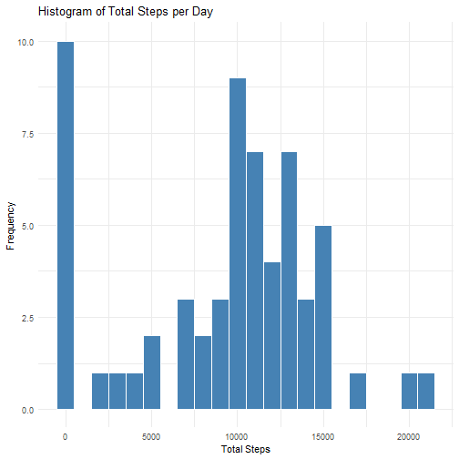
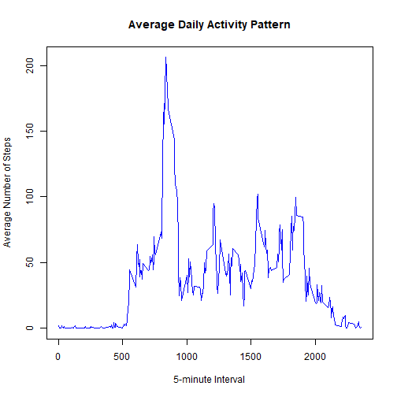
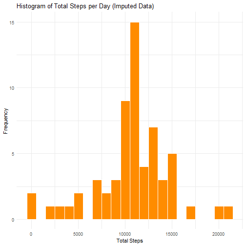
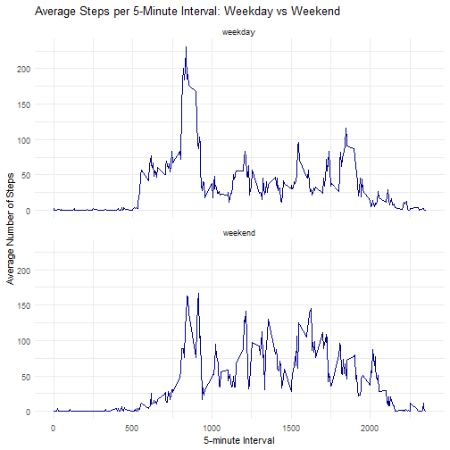

Start by loading the data and any necessary libraries

``` r
activity <- read.csv("activity.csv")  
library(dplyr)  
library(ggplot2)  
```
  
**Question 1: What is the mean total of steps taken per day?**  
1: Calculate the total number of steps taken per day  

``` r
total_steps_per_day <- activity %>%
        group_by(date) %>%
        summarize(total_steps = sum(steps, na.rm = TRUE))
```

2: Make a histogram of the total number of steps taken per day  

``` r
ggplot(total_steps_per_day, aes(x = total_steps)) +
        geom_histogram(binwidth = 1000, fill = "steelblue", color = "white") +
        labs(title = "Histogram of Total Steps per Day",
             x = "Total Steps",
             y = "Frequency") +
        theme_minimal()
```


  
3: Calculate the mean and median of the total daily number of steps

``` r
mean_steps <- mean(total_steps_per_day$total_steps)
median_steps <- median(total_steps_per_day$total_steps)
cat("Mean total steps per day:", mean_steps, "\n")
```

```
## Mean total steps per day: 9354.23
```

``` r
cat("Median total steps per day:", median_steps, "\n")
```

```
## Median total steps per day: 10395
```
  The mean number of steps taken per day is 9,354.23, with the median at 10,395.
  
**Question 2: What is the average daily activity pattern?**   

  1: Make a time-series plot for the 5-minute interval and the average number of steps.  

``` r
#Calculate average steps per interval across all days
average_steps_interval <- activity %>%
        group_by(interval) %>%
        summarize(mean_steps = mean(steps, na.rm = TRUE))

#Generate the time series plot 
plot(average_steps_interval$interval,
     average_steps_interval$mean_steps,
     type = "l",
     col = "blue",
     xlab = "5-minute Interval",
     ylab = "Average Number of Steps",
     main = "Average Daily Activity Pattern")
```



The 5-minute interval that, on average across all the days in the dataset, contains the maximum number of steps is the one with roughly 850.  

**Question 3: Imputing missing values**

1: Calculate the total number of missing values in the dataset  

``` r
#Calculate the total number of missing values in the dataset
missing_rows <- sum(is.na(activity$steps))
cat("Total number of missing values in 'steps':", missing_rows, "\n")
```

```
## Total number of missing values in 'steps': 2304
```
The total number of missing values in the dataset is 2304.

The strategy we will be employing to impute the missing values is replacing each missing value with the mean for that 5-minute interval.

2: Create a new imputed dataset using the strategy as mentioned above. 

``` r
interval_means <- activity %>%
        group_by(interval) %>%
        summarize(mean_steps = mean(steps, na.rm = TRUE))

imputed_data <- activity %>%
        left_join(interval_means, by = "interval") %>%
        mutate(steps = ifelse(is.na(steps), mean_steps, steps)) %>%
        select(steps, date, interval)  # Keep original column order

#Check the first few rows of your newly imputed data
head(imputed_data)
```

```
##       steps       date interval
## 1 1.7169811 2012-10-01        0
## 2 0.3396226 2012-10-01        5
## 3 0.1320755 2012-10-01       10
## 4 0.1509434 2012-10-01       15
## 5 0.0754717 2012-10-01       20
## 6 2.0943396 2012-10-01       25
```
3: Calculate the mean and median of the total daily steps taken for the newly imputed data.

``` r
#Summarize total steps per day from the imputed dataset
total_steps_imputed <- imputed_data %>%
        group_by(date) %>%
        summarize(total_steps = sum(steps))

#Calculate mean and median
mean_imputed <- mean(total_steps_imputed$total_steps)
median_imputed <- median(total_steps_imputed$total_steps)

cat("Mean total steps per day (imputed):", mean_imputed, "\n")
```

```
## Mean total steps per day (imputed): 10766.19
```

``` r
cat("Median total steps per day (imputed):", median_imputed, "\n")
```

```
## Median total steps per day (imputed): 10766.19
```
3.5: Make a histogram of total number of steps taken each day with this new imputed dataset.

``` r
ggplot(total_steps_imputed, aes(x = total_steps)) +
        geom_histogram(binwidth = 1000, fill = "darkorange", color = "white") +
        labs(title = "Histogram of Total Steps per Day (Imputed Data)",
             x = "Total Steps",
             y = "Frequency") +
        theme_minimal()
```



The mean daily total steps for the imputed data is 10766.19. The median for the data is 10766.19. 
These values do differ from the non-imputed estimates. Imputing the data inflates the estimates of total daily number of steps.

**Question 4: Are there differences in activity patterns between weekday and weekend?**

1: Create a new factor variable with two classes - weekday and weekend. 

``` r
#Convert to Date class
imputed_data$date <- as.Date(imputed_data$date)

#Create 'week' variable
imputed_data$week <- ifelse(weekdays(imputed_data$date) %in% c("Saturday", "Sunday"),
                            "weekend", "weekday")

#Convert to factor
imputed_data$week <- factor(imputed_data$week, levels = c("weekday", "weekend"))

#Check first few rows of new dataset
head(imputed_data)
```

```
##       steps       date interval    week
## 1 1.7169811 2012-10-01        0 weekday
## 2 0.3396226 2012-10-01        5 weekday
## 3 0.1320755 2012-10-01       10 weekday
## 4 0.1509434 2012-10-01       15 weekday
## 5 0.0754717 2012-10-01       20 weekday
## 6 2.0943396 2012-10-01       25 weekday
```
2: Generate a panel plot containing a time-series plot of the 5-minute interval and the average number of steps taken, averaged across all weekdays or weekends. 

``` r
#Calculate average steps per interval by week type
interval_weekly_avg <- imputed_data %>%
        group_by(week, interval) %>%
        summarize(mean_steps = mean(steps), .groups = "drop")

#Generate panel plot
ggplot(interval_weekly_avg, aes(x = interval, y = mean_steps)) +
        geom_line(color = "darkblue") +
        facet_wrap(~week, ncol = 1) +
        labs(title = "Average Steps per 5-Minute Interval: Weekday vs Weekend",
             x = "5-minute Interval",
             y = "Average Number of Steps") +
        theme_minimal()
```




